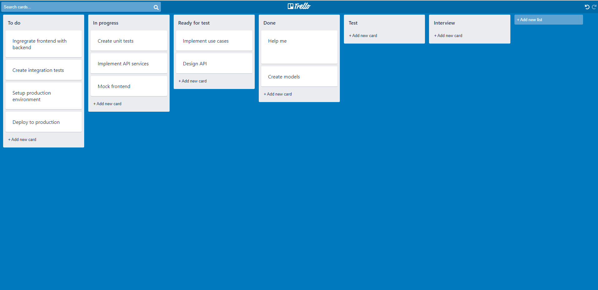

## Summary

A Trello board clone made with React + Redux

## Features
 - Create/delete columns
 - Create/delete cards
 - Edit card content
 - Edit column title
 - Move cards between columns
 - Re order cards in a list
 - Search cards
 - Undo/redo actions on list and cards
 - Duplicate cards
 - Duplicate lists
 - Save board state on local storage

## Available Scripts

In the project directory, you can run:

### `yarn start`

Runs the app in the development mode. 
Open [http://localhost:3000](http://localhost:3000) to view it in the browser.

### `yarn build`

Builds the app for production to the `build` folder. 
